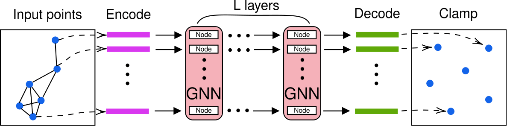

# Message-Passing Monte Carlo
This repository contains the official implementation of the **MPMC** method 
from the PNAS paper:
[Message-Passing Monte Carlo: Generating low-discrepancy point sets via Graph Neural Networks](https://arxiv.org/abs/2405.15059)

<p align="center">

</p>

### Requirements
Main dependencies (with python >= 3.7):<br />
torch==1.9.0<br />
torch-cluster==1.5.9<br />
torch-geometric==2.0.3<br />
torch-scatter==2.0.9<br />
torch-sparse==0.6.12<br />
torch-spline-conv==1.2.1<br />

Commands to install all the dependencies in a new conda environment <br />
*(python 3.7 and cuda 10.2 -- for other cuda versions change accordingly)*
```
conda create --name mpmc python=3.7
conda activate mpmc

pip install torch==1.9.0
pip install numpy

pip install torch-scatter -f https://pytorch-geometric.com/whl/torch-1.9.0+cu102.html
pip install torch-sparse -f https://pytorch-geometric.com/whl/torch-1.9.0+cu102.html
pip install torch-cluster -f https://pytorch-geometric.com/whl/torch-1.9.0+cu102.html
pip install torch-spline-conv -f https://pytorch-geometric.com/whl/torch-1.9.0+cu102.html
pip install torch-geometric
```
Alternatively, if one prefers conda, all pytorch geometric dependencies can be installed via
```
conda install pyg -c pyg
```
More details can be found on the pytorch geometric website: https://pytorch-geometric.readthedocs.io/en/latest/
### Run the experiments
To train MPMC, simply run
```
python run_train.py --kwargs
```
where kwargs are specified in `run_train.py` file.

# Usage tips
* **Runtime**: Runtime is greatly dependent on --epochs (in combination with
--start_reduce). For smaller number of points, 
both could probably be reduced by at least a factor of 5-10.
* **Higher dimensions:** The L2-discrepancy approach tends to break down around dimension 6. 
For higher dimensions, we recommend using the approximated Hickernell discrepancy. Note that this requires one
to choose specific dimensionalities of projections to emphasize during training. 
From our experience, setting --dim_emphasize=[1,2,3] often 
provides good results for most applications with low effective dimensionality.
* **L2-discrepancy vs star-discrepancy:** Our method minimizes L2-discrepancy, not star-discrepancy. However, if 
you aim to achieve low star-discrepancy, consider early stopping based on star-discrepancy 
while still training with L2-discrepancy.
* **fine-tuning:** For optimal results, we encourage fine-tuning the 
hyperparameters in the `run_train.py` file.

# Open problems
We outline several key open problems with the hope of inspiring the community to 
build upon and enhance our current approach:
* **Scalability for larger point sets:** As the number of points 
increases, performance degrades. A significant challenge is to 
scale MPMC effectively for point sets 
with orders of magnitude such as 10^5 points or more. 
Achieving this will likely require enhancing the current 
message-passing graph neural network (GNN) architecture.
* **Training for fixed number of points and dimension:** At present, 
MPMC must be retrained from scratch for each fixed number of points 
and dimensions. It would be highly beneficial if this limitation 
could be addressed. One potential direction is to exploit the 
generalization capabilities of GNNs in inductive graph learning 
tasks, which could at least alleviate the need for retraining when 
the number of points changes.
* **Randomization:**  Scrambling methods applied to Sobol 
and Halton sequences yield strong results, providing unbiased 
estimates. However, it remains unclear how to effectively 
randomize MPMC beyond simple random shifts. 
Further exploration in this area could yield valuable improvements.
* **Further open questions:** If you detect any other limitation that could be interesting
to add here, please reach out to me or open an issue,
and I will be happy to add it to this list.

# Citation
If you found our work useful in your research, please cite our paper at:
```bibtex
@article{rusch2024message,
  title={Message-Passing Monte Carlo: Generating low-discrepancy point sets via graph neural networks},
  author={Rusch, T Konstantin and Kirk, Nathan and Bronstein, Michael M and Lemieux, Christiane and Rus, Daniela},
  journal={Proceedings of the National Academy of Sciences},
  volume={121},
  number={40},
  pages={e2409913121},
  year={2024},
  publisher={National Academy of Sciences}
}
```
(Also consider starring the project on GitHub.)
